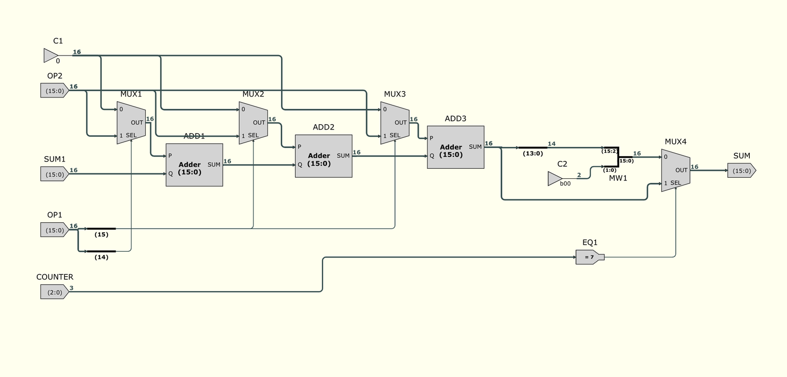
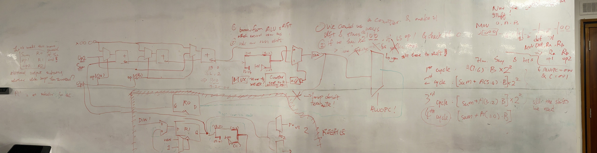
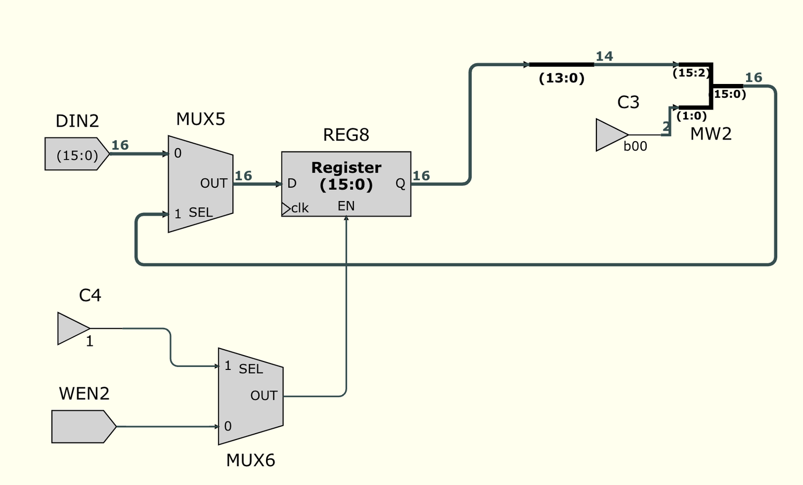
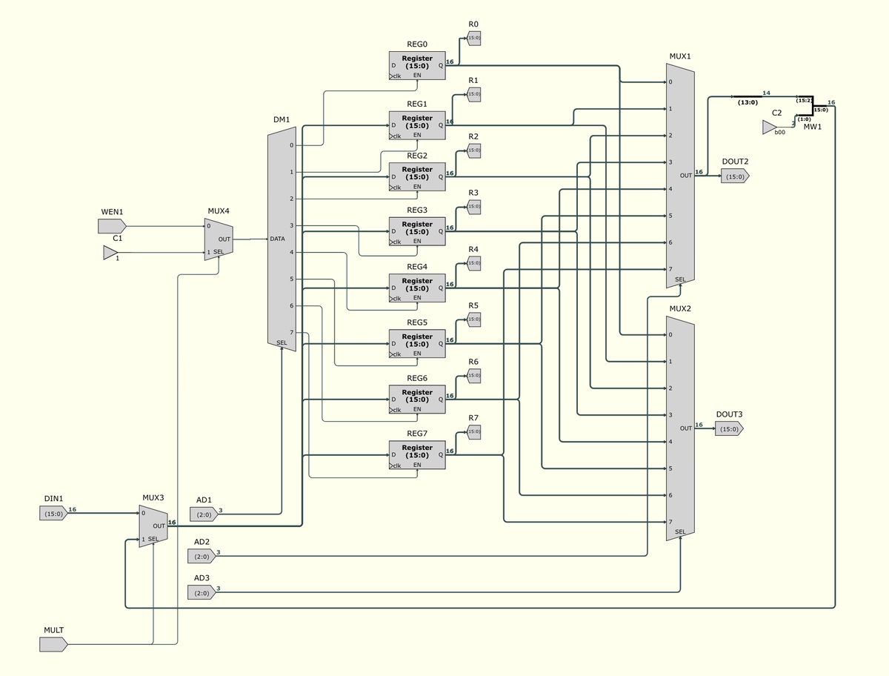
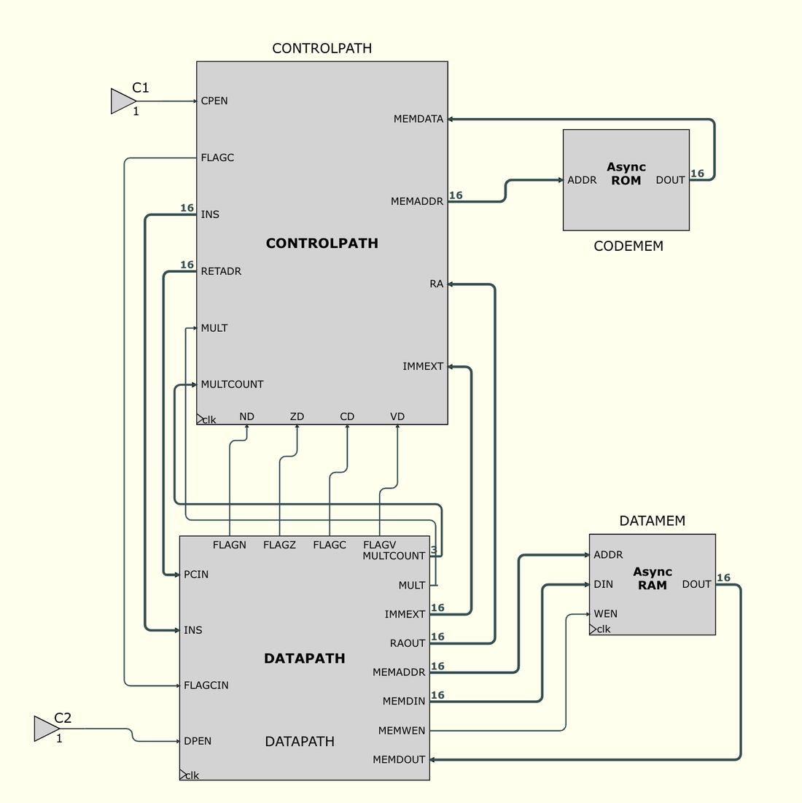
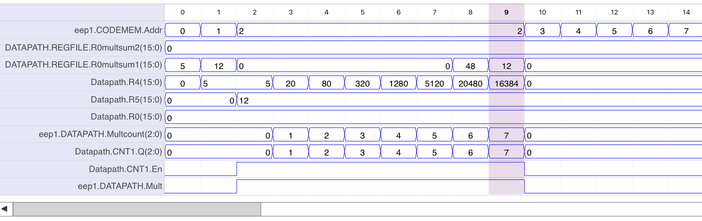
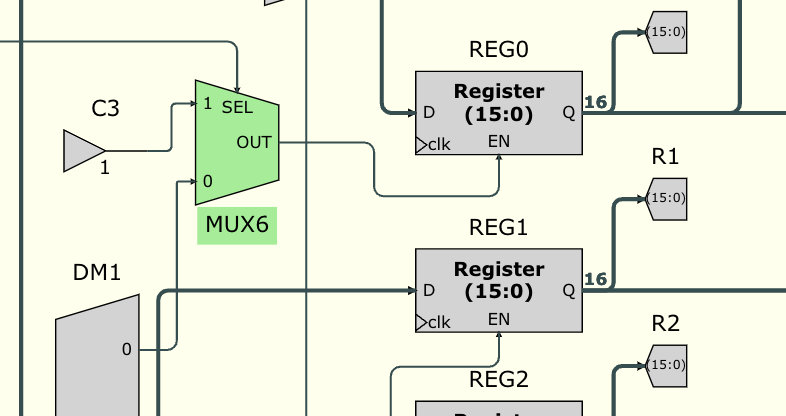
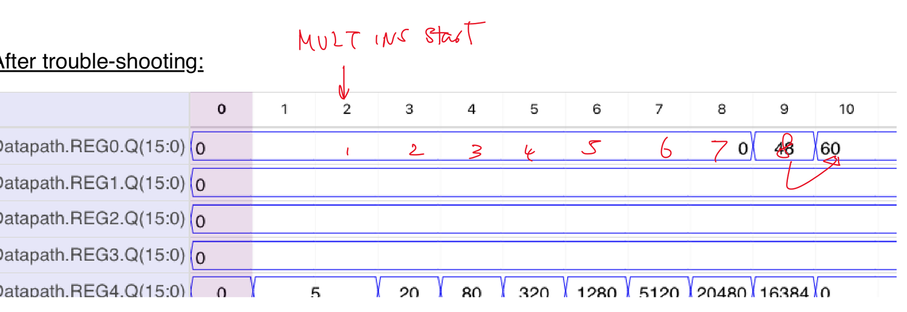
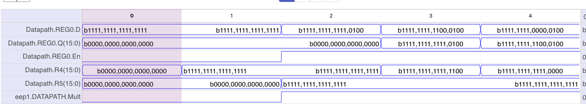

# A Custom Multiply Instruction for a 16-bit CPU

I added a hardware `MULT` instruction to a 16-bit CPU, built around a base-4 add-and-shift
datapath that processes two bits of the multiplier per clock cycle. It is a schematic-level
digital design, built and simulated in Issie as part of a digital design lab project — not
synthesised RTL.

The CPU I extended came from the lab course — register file, ALU, and a Harvard-style
control/data path over asynchronous ROM code memory and RAM data memory. **I did not design
the CPU.** My work is the multiply extension: the algorithm, the datapath that implements
it, the register-file modifications it required, the instruction decode and multi-cycle
control logic, and the verification.



*The multiply datapath: three chained adders (`ADD1`–`ADD3`), each gated by a MUX that
selects 0 or `op2`, with the top two bits of `op1` driving the selects. `MW1` performs the
2-bit left shift of the running sum; `EQ1` detects the final cycle and bypasses that shift.*

**Headline result:** a multiply instruction that completes in a deterministic 8 clock cycles
using only 3 full adders, verified in simulation up to its maximum operand range — which
testing revealed to be 7-bit unsigned (see
[the limitation](#testing-and-the-7-bit-limitation), found and characterised through testing
rather than known in advance).

A scan of the original lab logbook is included as `logbook.pdf` — it records the design
reasoning, simulation traces, and debugging in the order they actually happened.

---

## From software loop to hardware

The starting point is the standard software add-and-shift multiply:

```c
// sum := op1 * op2   (16-bit)
sum = 0;
op2_shifted = op2;
while (op1 != 0) {
    if (op1 & 1) sum = sum + op2_shifted;
    op2_shifted = op2_shifted << 1;
    op1 = op1 >> 1;
}
```

In software each line costs at least one instruction per loop iteration. In hardware, the
conditional add and the shifts can happen combinationally within a single clock cycle, so
the design question becomes: how many bits of `op1` can be retired per cycle at reasonable
combinational cost?



*Working the algorithm out before building anything.*

I chose **base 4**: process two bits of `op1` per cycle, shifting by 2 each step. The key
observation is that for any 2-bit group of the multiplier, the partial product is only ever
0, 1, 2 or 3 times `op2`:

```
A = a₁₅a₁₄ | a₁₃a₁₂ | ... | a₁a₀        (eight 2-bit groups)
A·B = ((...((A(15:14)·B)·4 + A(13:12)·B)·4 + ...)·4 + A(1:0)·B)
```

Each group's contribution (0–3 × `op2`) is cheap to build combinationally, and eight groups
means eight cycles for a 16-bit multiplier — half the iterations of the bit-serial version.

## Datapath

The partial-product stage is **three chained adders** (`ADD1`–`ADD3`), each preceded by a MUX
selecting whether it adds 0 or `op2`. The current 2-bit group of `op1` drives the MUX
selects: the higher bit of the pair carries doubled weighting so it enables two adders, the
lower bit enables one — giving 0, 1, 2 or 3 copies of `op2` accumulated in a single cycle.
Three full adders is the entire arithmetic cost of the multiplier.

Two decisions shaped the rest of the datapath:

**No `op2_shifted` register.** The software algorithm shifts `op2` left each iteration,
which in hardware would cost a dedicated register. Instead, accumulation starts from the
*most significant* group of `op1` and the running **SUM is shifted left by 2** each cycle.
Algebraically equivalent, one register cheaper. A bypass around the final shift (visible as
the wire from `ADD3.SUM` straight to `MUX4` in the diagram above) ensures the last group
`A(1:0)·B` is added without a trailing shift, so no correction step is needed at the end.

**Deterministic latency over early exit.** Because accumulation runs MSB-first, the loop
cannot terminate early when the remaining bits of `op1` are zero — every multiplication
takes exactly 16/2 = **8 clock cycles**. I kept this as a deliberate tradeoff: the result is
ready at a known, fixed time, with no ambiguity about whether an early-exit condition has
fired. A bit-serial LSB-first design could exit early, but then "is the result ready?"
becomes a question the rest of the CPU has to answer.

## The single-write-port problem

The register file has one write port, but a `MULT` step needs two state updates per cycle:
write the new SUM, *and* shift `op1` left by 2 so the next group is in position.

The solution is to make the register holding `op1` self-shifting: on each clock tick during a
multiply it re-loads its own output shifted left by 2, leaving the write port free for SUM.
On top of that mechanism I made two design decisions of my own.



*`MUX5` breaks the register's feedback loop and `MUX6` selects the enable source, giving each
register a normal mode and a multiplication mode.*

**Registers keep their day job.** A MUX breaks the register's feedback loop, giving every
register two modes: *normal mode* (standard `DIN`/`WEN` behaviour) and *multiplication mode*
(self-shift). Adding `MULT` support therefore costs no register its ordinary functionality —
outside a multiply, nothing about the register file changes.



*The modified register file. The `MULT` control signal (bottom left) switches `MUX3` and
`MUX4` to route the multiply datapath's feedback and enable into the register array, so
`op1` can live in any of R1–R7 rather than a fixed address.*

**Operand flexibility.** With one write port, either SUM or `op1` has to live at a fixed
address. I analysed both options and fixed **SUM at R0**, which leaves `op1` free to be any
of R1–R7. The alternative (fixed `op1`, flexible SUM) is symmetrical, but if `op2` can
already come from any register then `op1` should too. Adding a second write port would have
removed the constraint entirely, but would have meant new instruction-format definitions —
not worth it for one instruction.

The self-shift path was unit-tested standalone before integration: initialise a register
through normal mode, assert `MULT`, confirm the register and its read port shift left by 2
on every tick, then confirm normal write behaviour returns when `MULT` drops.

## Instruction encoding and control

`MULT` reuses the existing `MOV Rc, Ra, Rb` instruction template rather than defining a new
format: a `MOV` with condition field `C = 001` decodes as `MULT Ra, Rb`, result to R0. A
modified `DPDECODE` raises a dedicated `MULT` control signal when it sees this pattern — with
a guard on the instruction's immediate-mode bit, so `MOV Ra, IMMS8` (which shares the opcode
space) can never false-trigger a multiply.

Multi-cycle timing is handled by a **3-bit counter** and a **PC stall**:

- While `MULT` is asserted, the program counter holds (`PC.NEXT = PC + 0`), so the CPU sits
  on the multiply instruction.
- The counter increments each cycle; when it reaches 7 the PC resumes (`PC.NEXT = PC + 1`)
  and the counter wraps to 0, ready for the next `MULT`.



*Top level. `MULT` and `MULTCOUNT` are routed from the datapath back into the control path so
the `NEXT` block can see the counter and decide when to release the PC.*

I drew the full cycle-by-cycle timeline (PC, counter, ALU output, R0) before wiring the stall
logic, to catch off-by-one-tick errors on paper rather than in simulation.

## Verification and debugging

The first integrated test was `12 × 5` — `MOV R4,#5; MOV R5,#12; MOVC1 R4,R5`, expecting
`R0 = 60`. It failed: `R0` stayed at 0.



*The failure. `R4` (holding `op1`) shifts correctly through 5 → 20 → 80 → … → 16384 and the
counter runs 0→7, so the multiply datapath and control logic are both working — but
`Datapath.R0` never moves off 0.*

Tracing further showed `REG0.EN` was never asserted. The enable logic still reflected the
original register file: R0's enable depended on the write-address demux (`AD1`), and during a
multiply `AD1` points at `op1`, which is never R0. The enable logic simply hadn't been
extended to account for the new multiplication mode.



*The fix: `MUX6` selects R0's enable from the multiply path when `MULT` is asserted, instead
of relying on the write-address decode.*



*After the fix. Eight clock ticks of accumulation, then 48 → 60 in R0 — the extra tick being
the expected register delay between the result being computed and appearing at R0.*

Further verification, all in step simulation:

| Test | Expected | Result |
|---|---|---|
| 12 × 5 | 60 | ✅ correct, 8 cycles + 1 tick |
| 12 × 17 | 204 | ✅ correct |
| 127 × 126 | 16,002 | ✅ correct |
| 127 × 127 | 16,129 | ✅ correct — maximum valid input |
| 128 × 127 | 16,256 | ❌ 49,280 |
| 255 × 255 | 65,025 | ❌ wrong |

## Testing and the 7-bit limitation

The `255 × 255` failure was the interesting one. Watching R0 in binary showed the accumulated
value *shrinking* across cycles — not an arithmetic bug in the multiplier, but a data problem
upstream.



*`R4` and `R5` both hold `b1111,1111,1111,1111` — the CPU's decode stage **sign-extends the
8-bit immediate** (`IMMS8`) on load, so 255 arrives at the multiplier as −1 rather than 255.*

Any operand with bit 7 set (≥ 128) becomes a negative 16-bit value before the multiply ever
sees it. So the design, as integrated in this CPU, is effectively a **7-bit unsigned
multiplier**: the maximum valid product is 127 × 127 = 16,129, which simulates correctly;
128 × 127 does not. I found this through testing, diagnosed the cause to sign-extension in
decode rather than to the multiply datapath, and characterised the exact boundary — it is a
limitation of how operands reach the multiplier, not of the add-and-shift core itself.

## Evaluation

**What the design gets right**

- 3 full adders total — the entire multiply array is smaller than most ALU slices
- Deterministic 8-cycle completion: the result's arrival time is known exactly, with no
  "has the loop exited yet?" ambiguity
- `op1` and `op2` can come from (almost) any register; SUM fixed at R0 was a reasoned choice
- No register loses its normal functionality — multiplication mode is multiplexed in, not
  carved out
- MSB-first accumulation eliminates the `op2_shifted` register entirely

**Costs and weaknesses**

- Cannot terminate early, even when the remaining multiplier bits are zero
- 8 cycles is far from fast — a wider radix or a combinational array would beat it
- MUX-heavy: mode switching and partial-product selection spend a fair number of MUXes

**Improvements I identified**

- Pipelining the accumulation for throughput
- An unsigned-extension load path, which would lift the 7-bit ceiling to a true 8-bit
  unsigned multiplier without touching the datapath
- Extending to 16 × 16: needs 32-bit accumulation, which breaks the shift-by-2 scheme as
  built (left shifts can't carry across a 16-bit register boundary; roughly 4 ADD/ADC steps
  per group, or a 32-bit temporary register with a bus spreader to write results back)

## Repository contents

- `logbook.pdf` — scan of the original lab logbook: the design reasoning, whiteboard
  derivation, full schematics, simulation traces, the debugging record, and in-lab
  proof-of-work screenshots
- `docs/img/` — figures used in this README, extracted from the logbook

The Issie design files themselves aren't included — they only open in Issie, so they aren't
independently readable or reproducible, and the logbook already contains every schematic and
waveform in full.

## Tools

Built in [Issie](https://github.com/tomcl/issie) — a schematic digital design and simulation
tool developed at Imperial College London, not part of this project. All schematics and
waveforms above are from Issie's editor and step simulator.
